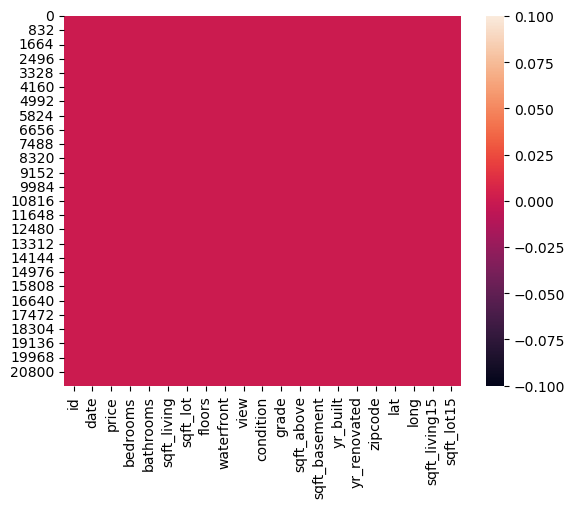
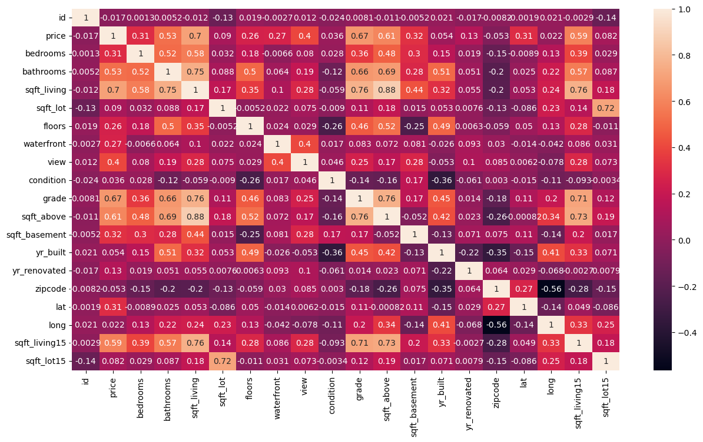
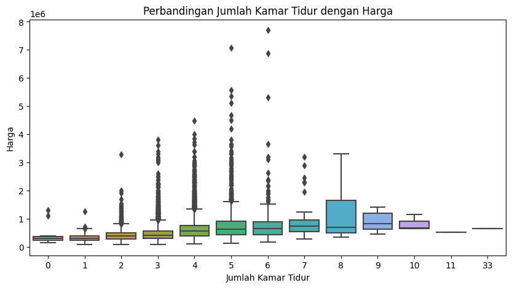

# Laporan Proyek Machine Learning
### Nama : Astrid Putri Salsabiela
### NIM : 211351032
### Kelas : Malam A

## Domain Proyek
Proyek Price Prediction dari data KC House bertujuan untuk memprediksi harga rumah di wilayah King County. Ini akan membantu calon pembeli atau penjual untuk mendapatkan estimasi harga rumah berdasarkan beberapa faktor seperti luas tanah, jumlah kamar, lokasi, dll. Dengan adanya prediksi harga, pengguna dapat membuat keputusan yang lebih informasional dan cerdas dalam transaksi properti.

## Business Understanding
Untuk memahami dan melakukan price prediction (prediksi harga) dengan menggunakan data rumah seperti King County House Data, adalah penting untuk memiliki pemahaman bisnis yang kuat.

### Problem Statements
Mencari harga rumah yang sesuai dengan kebutuhan dan anggaran dapat menjadi tugas yang rumit dan memakan waktu. Potensial pembeli dan penjual memerlukan alat yang dapat memberikan estimasi harga yang akurat untuk rumah yang mereka minati.

### Goals
Tujuan utama proyek ini adalah memberikan solusi yang dapat memberikan estimasi harga rumah yang akurat berdasarkan atribut-atribut tertentu. Solusi ini akan membantu calon pembeli atau penjual rumah untuk membuat keputusan yang lebih baik.

### Solution Statements
Solusi proyek ini adalah membangun model Machine Learning yang akan menggunakan data historis rumah di King County untuk memprediksi harga rumah di masa depan. Model ini akan memperhitungkan berbagai atribut seperti luas tanah, jumlah kamar, lokasi, dll.

## Data Understanding
Dataset yang digunakan dalam proyek ini adalah data rumah di wilayah King County, mencakup informasi tentang harga rumah dan atribut-atribut lainnya seperti jumlah kamar, luas tanah, dan lokasi. Dan dataset ini mengandung lebih dari 10 columns.

[kaggle](https://www.kaggle.com/datasets/ahmedmmmahmoud/kc-house-data)

### Dalam proyek Price Prediction dari data KC House, variabel-variabel yang biasanya digunakan untuk memprediksi harga rumah (harga properti) termasuk:
1. Price: Variabel target, yaitu harga rumah yang ingin diprediksi.
2. Bedrooms: Jumlah kamar tidur di dalam rumah.
3. Bathrooms: Jumlah kamar mandi di dalam rumah.
4. Sqft_living: Luas area rumah (dalam satuan kaki persegi).
5. Sqft_lot: Luas area tanah (dalam satuan kaki persegi).
6. Floors: Jumlah lantai rumah.
7. Condition: Kondisi umum rumah.
8. Grade: Peringkat kualitas rumah.
9. View: Apakah rumah memiliki pemandangan (misalnya, pemandangan pegunungan, laut, dll.).
10. Waterfront: Apakah rumah berada di tepi pantai.
11. Year Built: Tahun pembangunan rumah.
12. Year Renovated: Tahun renovasi terakhir.
13. Zipcode: Kode pos wilayah rumah.
14. Lat: Koordinat lintang (latitude) lokasi rumah.
15. Long: Koordinat bujur (longitude) lokasi rumah.
16. Date: Tanggal penjualan atau catatan penjualan.

## Data Preparation
### Data Collection
Mulai dengan mengumpulkan dataset kc house yang dapat di unduh dari website kaggle dengan nama dataset kc house data.

### Data Discovery And Profiling
Pertama import semua library yang dibutuhkan,
```
import pandas as pd
import numpy as np
import matplotlib.pyplot as plt
import seaborn as sns
```
selanjutnya kita lakukan import file, dan upload file tersebut di google colab
```
from google.colab import files
files.upload()
```

Setelah mengupload filenya, maka kita akan melanjutkan dengan membuat sebuah folder untuk menyimpan file kaggle.json yang sudah diupload tadi
```
!mkdir -p ~/.kaggle
!cp kaggle.json ~/.kaggle/
!chmod 600 ~/.kaggle/kaggle.json
!ls ~/.kaggle
```

Selanjutnya kita akan mendownload datasetnya
```
!kaggle datasets download -d shmedmmmahmoud/kc-house-data
```

Ekstrak file yang sudah di download
```
!mkdir kc-house-data
!unzip kc-house-data.zip -d kc-house-data
!ls kc-house-data
```

load data, baca dataset ke dalam DataFrame Pandas
```
data = pd.read_csv('kc_house_data.csv')
```

lakukan pemeriksaan awal data, termasuk melihat struktur data, tipe data kolom, dan beberapa baris pertama data
```
data.head()
data.info()
```

jika ada kolom yang tidak relevan untuk analisis atau prediksi, anda bisa menghapusnya
```
data = data.drop(['id', 'date'], axis=1)
```

selanjutnya kita akan memeriksa apakah datasetsnya terdapat baris yang kosong atau null dengan menggunakan seaborn,
```
sns.heatmap(data.isnull())
```


lanjut dengan data exploration,
```
data = data.drop(columns=['date'])
correlation_matrix = data.corr()
plt.figure(figsize=(15,8))
sn.heatmap(data.corr(),annot=True)
```


hitung statistik deskriptif untuk variabel numerik
```
data.describe()
```

Analisis Data

Distribusi harga rumah
```
plt.figure(figsize=(10, 5))
sn.histplot(data['price'], kde=True)
plt.title('Distribusi Harga Rumah')
plt.xlabel('Harga')
plt.show()
```
](https://github.com/astridsalsabiela/streamlit_house/assets/148685629/1bb8d805-53b2-4c5b-9547-5a58e643d3c8)
)

Perbandingan jumlah kamar tidur dengan harga
```
plt.figure(figsize=(10, 5))
sn.boxplot(x=data['bedrooms'], y=data['price'])
plt.title('Perbandingan Jumlah Kamar Tidur dengan Harga')
plt.xlabel('Jumlah Kamar Tidur')
plt.ylabel('Harga')
plt.show()
```


## Data Modeling
Model Machine Learning, seperti Linear Regression, akan digunakan untuk memprediksi harga rumah berdasarkan atribut yang diberikan.

import library yang akan digunakan terlebih dahulu,
```
from sklearn.model_selection import train_test_split
from sklearn.linear_model import LinearRegression
```

Memilih atribut yang akan digunakan untuk prediksi
```
features = ['sqft_living', 'bedrooms', 'bathrooms', 'floors', 'condition', 'grade','yr_built']
X = data[features]
y = data['price']
```

Membagi data menjadi data latih dan data uji
```
X_train, X_test, y_train, y_test = train_test_split
(X, y, test_size=0.2, random_state=42)
```

Membangun model Linear Regression
```
model = LinearRegression()
model.fit(X_train, y_train)
```

Melakukan prediksi harga rumah
```
y_pred = model.predict(X_test)
```

## Evaluation
Secara singkat, inilah penjelasan singkat untuk metrik-metrik evaluasi dalam konteks regresi:
1. **R-squared (R2) Score**:
   - R2 Score mengukur sejauh mana model regresi cocok dengan data aktual.
   - Nilai R2 berkisar antara 0 hingga 1, di mana 1 menunjukkan model yang sempurna cocok.
   - Semakin mendekati 1, semakin baik modelnya.
2. **Mean Absolute Error (MAE)**:
   - MAE adalah rata-rata dari selisih absolut antara prediksi model dan nilai sebenarnya.
   - MAE mengukur kesalahan prediksi dalam skala asli.
   - Semakin rendah MAE, semakin baik modelnya.
3. **Mean Squared Error (MSE)**:
   - MSE adalah rata-rata dari kuadrat kesalahan prediksi.
   - MSE memberikan lebih banyak penalti terhadap kesalahan besar dibandingkan dengan MAE.
   - Semakin rendah MSE, semakin baik modelnya.
4. **Root Mean Squared Error (RMSE)**:
   - RMSE adalah akar kuadrat dari MSE.
   - RMSE mengukur kesalahan prediksi dalam skala asli, seperti MAE.
   - RMSE lebih sensitif terhadap kesalahan besar karena mengakar kuadrat kesalahan.
   - Semakin rendah RMSE, semakin baik modelnya.

Jadi, R2 Score digunakan untuk mengukur sejauh mana model cocok dengan data, sementara MAE, MSE, dan RMSE digunakan untuk mengukur besarnya kesalahan prediksi dalam berbagai skala. Semua metrik ini digunakan untuk mengevaluasi kinerja model regresi, dan tujuan utamanya adalah untuk meminimalkan kesalahan prediksi.

Maka untuk dataset regregi seperti KC House, metrik yang umum digunakan untuk dievaluasi menggunakan metrik seperti Mean Absolute Error (MAE) atau Root Mean Squared Error (RMSE), R-squared (R2) untuk mengukur seberapa akurat model dalam memprediksi harga rumah.

```
from sklearn.metrics import r2_score, mean_absolute_error, mean_squared_error, root_mean_squared_error
from sklearn import metrics
```

```
print("r_2 score is:",metrics.r2_score(y_test,y_pred))
print("Mean Absolute Error:", metrics.mean_absolute_error( y_test,y_pred))
print("Mean Squared Error:", metrics.mean_squared_error(y_test,y_pred))
`print("Root Mean Squared Error:", np.sqrt(metrics.mean_squared_error(y_test,y_pred)))
```

dan menghasilkan,

r_2 score is: 0.7066787500012532

Mean Absolute Error: 126008.92653280184

Mean Squared Error: 40597428449.48715

Root Mean Squared Error: 201488.03549959772


```
plt.xticks(rotation=45)
plt.bar(names,values)
plt.xlabel("Multiple Algorithms")
plt.ylabel("r_2 scores")
plt.show()
```
](https://github.com/astridsalsabiela/streamlit_house/assets/148685629/f886ea31-5eb0-45fd-980f-5de67c0b27d8)
)

## Deployment
Model yang telah dilatih akan dideploy dalam sebuah aplikasi atau platform yang memungkinkan pengguna untuk memasukkan atribut rumah dan mendapatkan estimasi harga.

[My Prediction App[]([https://kc-house.streamlit.app/)](https://apphouse-tvb9zkr3e7brzjxrgo3fmu.streamlit.app/)]


